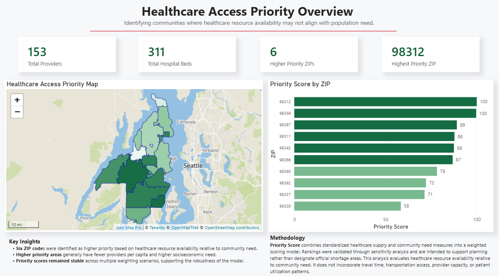
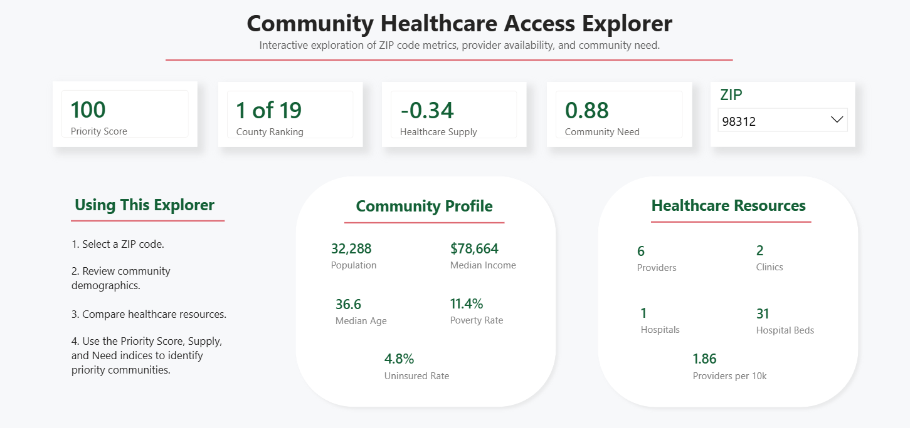

# Kitsap County Healthcare Access Analysis


------------------------------------------------------

An end-to-end healthcare analytics project that combines public demographic, healthcare facility, and geospatial data to identify communities where healthcare resources may not align with population need.

Using Python, SQLite, and Power BI, I developed a Healthcare Access Priority Score to help visualize potential disparities in healthcare access across Kitsap County, Washington.

**The analysis identified 98312 (West Bremerton), 98359 (Olalla), and 98367 (Port Orchard area) as the highest-priority communities for further investigation, each representing a different pattern of potential healthcare access challenges.**

---

# Project Overview

Healthcare resources are often distributed unevenly across communities. This project explores whether healthcare supply aligns with community need by combining multiple public datasets into a single priority score that supports data-driven planning.

## Business Objective

> **Identify communities where healthcare resource availability may not align with community need to support healthcare planning and resource allocation.**

### Key Question

> **Which communities should healthcare planners prioritize for further investigation?**

---

## Tools & Technologies

- Python
- Pandas
- GeoPandas
- SQLite
- SQL
- Power BI
- VS Code
- GitHub

---

## Data Sources

This project combines data from three public sources:

- **American Community Survey (ACS)** – Population demographics, income, poverty, insurance coverage, and age
- **Washington State Healthcare Facility Data** – Primary care clinics, hospitals, provider counts, and hospital beds
- **U.S. Census TIGER/Line ZCTAs** – ZIP Code Tabulation Area boundaries for geospatial analysis and mapping

---

## Methodology

### 1. Data Collection & Cleaning

- Imported healthcare facility, census, and geographic boundary datasets
- Cleaned and standardized ZIP code data
- Filtered records to Kitsap County ZIP Code Tabulation Areas (ZCTAs)

### 2. Data Integration

- Merged demographic and healthcare datasets using ZIP Code Tabulation Areas (ZCTAs)
- Created a unified SQLite database for analysis

### 3. Feature Engineering

Calculated healthcare supply metrics including:

- Providers per 10,000 residents
- Clinics per 10,000 residents
- Hospital beds per 10,000 residents

Calculated community need metrics including:

- Poverty rate
- Uninsured rate
- Median household income
- Population aged 65+

### 4. Priority Model

Developed a weighted Healthcare Access Priority Score by combining standardized healthcare supply and community need indicators.

### 5. Validation

Performed sensitivity analysis using alternative weighting scenarios to evaluate the stability of community rankings.

### 6. Dashboard Development

Built an interactive Power BI report featuring:

- Executive Dashboard
- Community Explorer
- Interactive ZIP code filtering
- Geographic healthcare access mapping

---

## Reproducible Analysis Pipeline

The analysis was automated using a 10-step Python workflow that:

- Collects public Census data
- Cleans and standardizes demographic and provider datasets
- Calculates healthcare supply metrics
- Builds a SQLite database
- Generates the Healthcare Access Priority Score
- Performs sensitivity analysis
- Produces the geospatial dataset used in Power BI

---

# 📊 Dashboard Preview

## Executive Dashboard



---

## Community Explorer



---

## 🔍 Key Insights

The Healthcare Access Priority Model identified three communities as the highest priorities for further investigation. Although all ranked highly, they represent different patterns of potential healthcare access challenges.

| Community | Key Insight |
|-----------|-------------|
| **98312 (West Bremerton)** | Large population with **comparatively limited provider availability** (1.86 providers per 10,000 residents). |
| **98359 (Olalla)** | No local healthcare facilities identified within the ZIP code. |
| **98367 (Port Orchard area)** | Large residential community with no local healthcare facilities identified despite serving more than 31,000 residents. |

> **Recommendation:** Use these findings to prioritize targeted community assessment, including travel time, provider capacity, transportation access, and other local barriers not captured in this analysis.

> **Note:** The Healthcare Access Priority Score is intended as a screening tool to identify communities that may warrant further investigation. It does not directly measure healthcare access or account for factors such as travel time, provider capacity, or patient utilization.

---

## Repository Structure

```text
healthcare_access_kitsap/
│
├── data/
│   └── cleaned/
├── docs/
├── images/
├── powerbi/
├── presentation/
├── python/
├── sql/
└── README.md
```

---

## Skills Demonstrated

- Data Cleaning
- Data Integration
- Feature Engineering
- Geospatial Analysis
- Python Automation
- SQL & SQLite
- Power BI Dashboard Design
- Data Visualization
- Healthcare Analytics
- Public Health Data Analysis

---

## Project Takeaways

This project demonstrates an end-to-end healthcare analytics workflow—from acquiring and integrating public datasets to developing a reproducible healthcare prioritization model and communicating findings through interactive dashboards and executive presentations.

While the Healthcare Access Priority Score is intended as a screening tool rather than a direct measure of healthcare access, it illustrates how publicly available data can be integrated to support evidence-based decision making.

---

## Author

**Jen Fordham, RHIA**

Healthcare Data Analyst passionate about using analytics, visualization, and public data to support better healthcare decision-making.

- LinkedIn: https://www.linkedin.com/in/jencfordham/
- GitHub: https://github.com/JenFordham

## More Projects

Interested in more healthcare analytics work?

➡️ **Healthcare Duplicate MRN Analytics Platform**
- Operational healthcare analytics
- SQL, Python, SQLite, Power BI
- Root-cause analysis of duplicate medical record creation